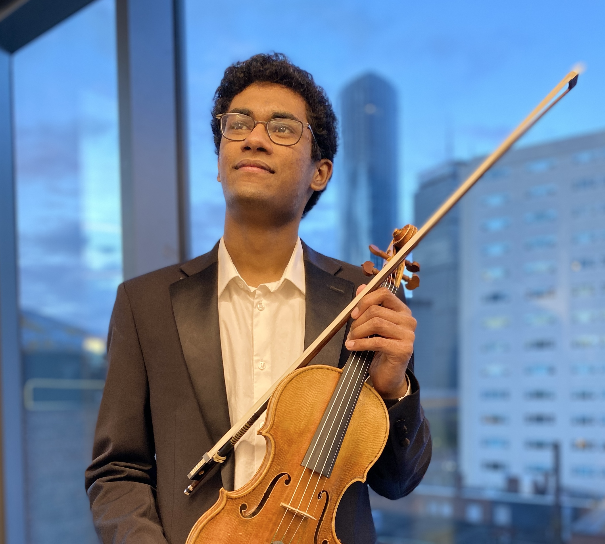

<!--
This content will be displayed at the top of the index page.
You can leave this empty if you don’t want to show any content.
-->

**Arun is a scientist and musician.** He is interested in how music moves people. His research combines systems neuroscience, music cognition, and affective science to understand how a predictive brain makes meaning from ordered sound. Specifically, he is interested in the role of interoception--a brain's inference and control over a body--in musical pleasure.

Currently, Arun is pursuing a PhD at Northeastern University in the Music Image and Neural Dynamics lab working with Dr. Psyche Loui. He completed a Bachelor's of Music in violin performance at the New England Conservatory studying under Prof. Nicholas Kitchen, and has been playing violin for just about two decades. His past work has used neuroimaging methods during live and recorded music to investigate how live performance uniquely engages the listening brain. In addition, he has worked on health related projects leveraging rhythms in music to stimulate brain dynamics and promote healthy cognition. His current work examines the brain as a predictive organ operating across information from the external world (e.g., music) and from the internal world (e.g., the heart, lungs, etc.). He is interested in how the brain and body together make meaning from the complex configurations of sound that we call music.