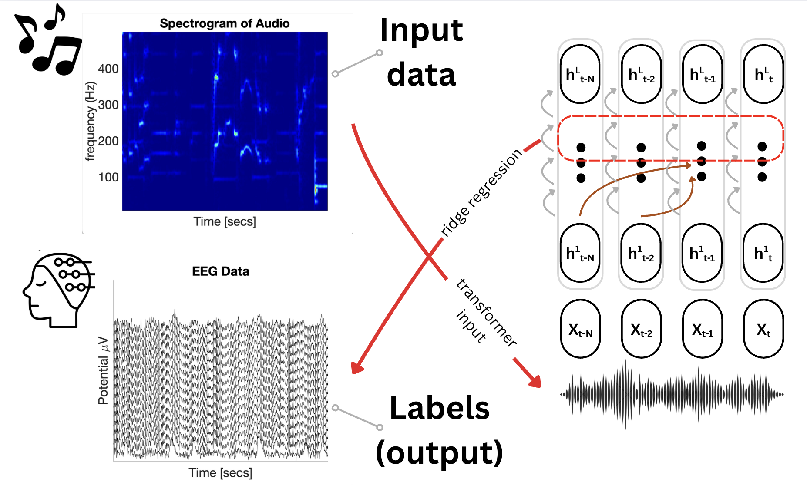

# Using LLMs to understand Musical Predictions

The human brain is thought to process sensory stimuli by making predictions.[^1] Specifically, predictive coding theory posits that the neocortex hierarchically compares input signals against top-down signals from a generative model.[^2] To test for the existance of this generative model in the brain, researchers have compared activity in large language models to neural activity in human listeners during speech perception. [^3] Less is known about whether large language model representations of music similarly map onto the human brain. In this project, I used MusicGen [^4], a multi-stage transformer trained on autoregressive acoustic prediction, to test whether musical predictions are encoded in EEG activity.

[^1]: Clark A. Whatever next? Predictive brains, situated agents, and the future of cognitive science. *Behavioral and Brain Sciences*. 2013;36(3):181-204. doi:10.1017/S0140525X12000477
[^2]: Rao, R. P. N., & Ballard, D. H. (1999). Predictive coding in the visual cortex: A functional interpretation of some extra-classical receptive-field effects. *Nature Neuroscience*, *2*(1), 79–87. https://doi.org/10.1038/4580
[^4]: Caucheteux, C., Gramfort, A., & King, J.-R. (2023). Evidence of a predictive coding hierarchy in the human brain listening to speech. *Nature Human Behaviour*, *7*(3), 430–441. https://doi.org/10.1038/s41562-022-01516-2
[^5]: Copet, J., Kreuk, F., Gat, I., Remez, T., Kant, D., Synnaeve, G., Adi, Y., & Défossez, A. (2024). *Simple and Controllable Music Generation* (No. arXiv:2306.05284). arXiv. http://arxiv.org/abs/2306.05284