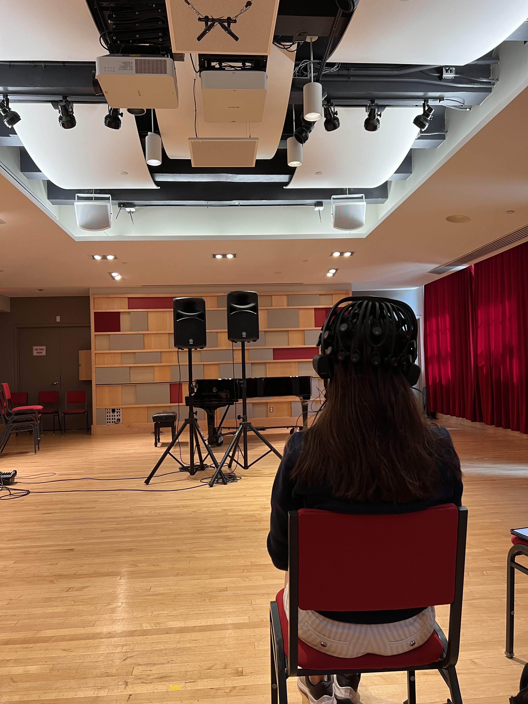
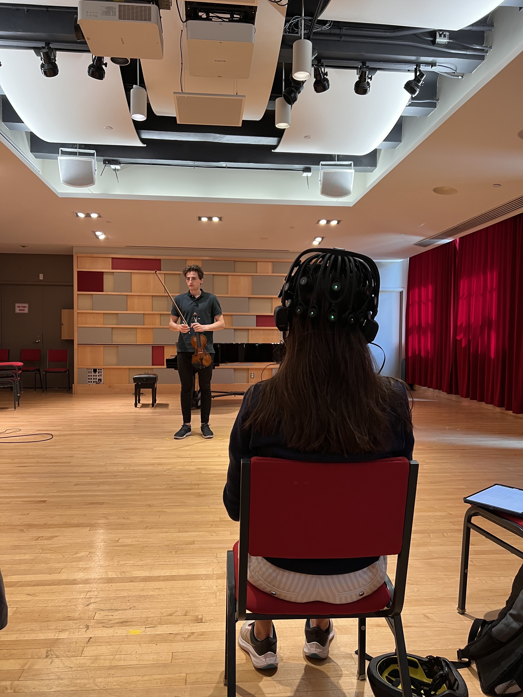

# From Lab to Concert Hall: Effects of Live Performance on Neural Entrainment and Engagement

This was the first project I led in the Music Imaging and Neural Dynamics lab working with Dr. Psyche Loui. I had the idea for it while a student at the New England Conservatory. I was fascinated by the experience of *liveness* in music---the feeling of being captivated by the spontaneous moment given to us by a live performer. Every musician and music-lover seeks out *liveness*, but we know little about how it is reflected in the brain. To this end, we measured neural activity (using EEG) from 21 participants who separately listened to live and recorded performances of solo violin music in a concert hall. We looked for differences in neural entrainment---the process of neural oscillations (also called brain rhythms) aligning with rhythms in the music itself. Our results provided novel insight into how live compared with recorded music uniquely engages the listening brain.

I wrote and won the Entrepreneurial Musicianship grant at NEC in 2024 and began to foster an interdisciplinary collaboration between the MIND Lab and the music conservatory. I worked with Dr. Psyche Loui to design and conduct the experiment. I worked with world-renowned violinist [Joshua Brown](https://www.joshuabrownviolinist.com/), who gave around 50 live performances for my participants. We conducted the experiment at Pierce Hall at the New England Conservatory. I fondly (not so fondly) remember carrying our speaker system and EEG system back and forth from the MIND Lab to Pierce Hall for each participant session. Thank you to all the people behind the scenes---friends, family, administration :smile:---who helped make it happen.

This is an [article](https://necmusic.edu/about/news/how-an-nec-violin-student-used-cutting-edge-neuroscience-to-understand-the-unspoken-connection-between-performer-and-audience/) that NEC wrote about the study.

This is our [pre-print](https://pubmed.ncbi.nlm.nih.gov/40236171/) of the research article, which is currently in review. 

Here are some fun pictures:

