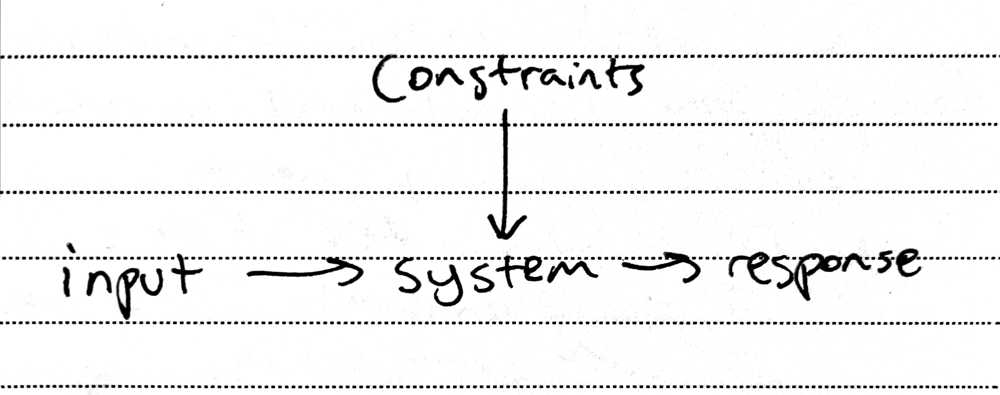
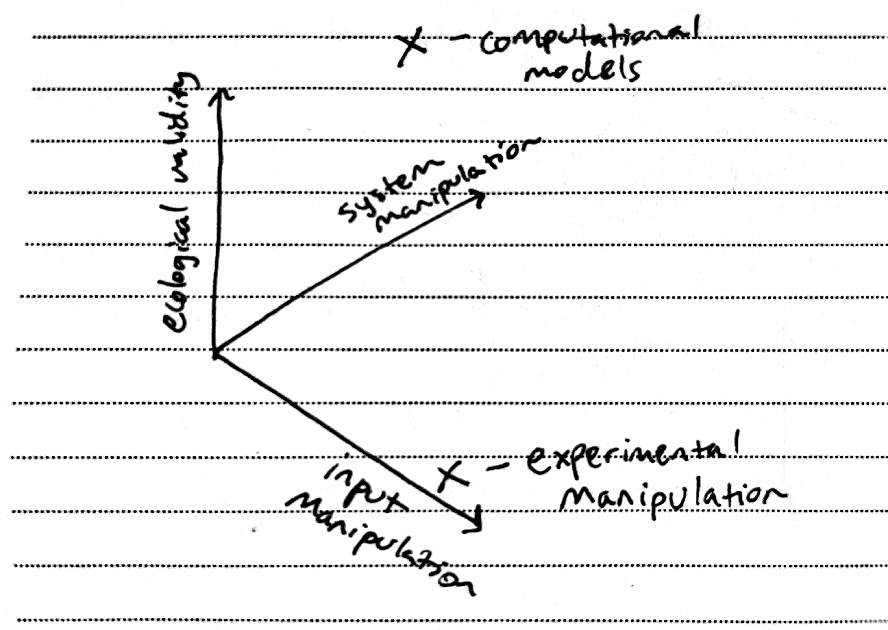

# Reflections on Music, Models, and Brains: SMPC and CCN Conferences 2026

## Why I wrote this
I had the privelege of attending two really different conferences over the last few weeks. One was the Society for Music Perception and Cognition ([SMPC](https://www.musicperception.org/program)); the other was the Cognitive Computational Neuroscience conference ([CCN](https://2026.ccneuro.org/)). Here, I'll share some reflections from these conferences, focusing on when, why, and how computational models can help us understand music and the brain.

At SMPC, I presented on how generatve models of music recapitulate some classic findings in music perception (like octave equivalence and circular key area relationships) and how they can be used to study musical predictions in the brain during naturalistic listening. My goal was to apply recent advances in music and machine learning to better understand music perception in humans. 

While many of the methods were new, the approach followed from a long tradition of computational modeling in music perception. For instance, early music cognition researchers developed perceptual models of pitch, tonality, and timbre using similarity judgements from human listeners ([Shepard, 1982](https://doi.apa.org/doi/10.1037/0033-295X.89.4.305); [Krumhansl, 1990](https://psycnet.apa.org/record/2004-14155-000), [Grey, 1977](https://pubs.aip.org/jasa/article/61/5/1270/626725/Multidimensional-perceptual-scaling-of-musical)). Some other computational approaches that have been particularly impactful have been models of musical expectation ([Pearce, 2018](https://nyaspubs.onlinelibrary.wiley.com/doi/10.1111/nyas.13654); [Temperley, 2006](https://doi.org/10.7551/mitpress/4807.001.0001)) and connectionist models of hierarchical structure ([Tillman et al., 2000](https://doi.apa.org/doi/10.1037/0033-295X.107.4.885)). 

Computational models in music perception mirror a broader thread of modeling in psychology and cognitive science[^previous-models] and in general, computational models have been extremely important in formalizing and testing theories about how the mind and brain work. The questions that arise then are: what kinds of models are useful, when are they useful, and how should they be used?

In the modern age of neuroscience and AI, these questions are especially important because we now have complicated models that can do complicated things, but diverge from human biology in some fundamental ways.[^AI-brain-gap] As a result, using artificial neural networks to understand a brain may simply be "using black boxes to study other black boxes". These issues were central to the CCN 2026 conference: how do modern deep learning models align and diverge from human minds and how they can be used to study human cognition? Some sessions at this conference were titled: "[Is NeuroAI adopting the right methods and theoretical frameworks to advance our understanding of mind and brain?](https://sites.google.com/ccneuro.org/gac2020/gacs-by-year/2026-gacs/2026-1)" and "[So You Have a Highly Predictive Model, Now What?](https://2026.ccneuro.org/community-event-highly-predictive-model/)". 

This post is my current take on the answers to these questions and how they apply to the study of music perception.

## My takeaways from SMPC and CCN 

**1. What are computational models useful for?**

Let's say we're interested in the brain, which is a system that operates under certain constraints. These constraints include the biology of the action potential, the metabolic cost of neural firing, the connectivity between regions of the brain, how this connectivity changes as a function of experience, etc.[^brain-constraints] Now, let's say we're studying how the brain responds to harmonic violations in music. The traditional approach is to manipulate a feature of the input and observe how that impacts the system response. In our example, this would be manipulating the expectedness of certain chords and measuring the brain resopnse.[^but-expectedness] Alternatively, we can build a computational model for what we think the system is doing and compare that model to the brain. Then, we become interested in what the constraints are that give rise to the system's behavior. 

To make this distinction more concrete, let's consider two classic experiments that study harmonic expectation: [Koelsch et al., 2000](https://doi.org/10.1162/089892900562183) and [Cheung et al., 2019](https://doi.org/10.1016/j.cub.2019.09.067). In Koelsch et al., 2000, the authors vary the input to the system of interest. They present chord sequences that are common in Western classical music (i.e., I->I->IV->V->I) and chord sequences that include a less conventional Neopolitan 6th chord to compare harmonic violations against expected chords. They find a neural component (a right anterior ERP ~150 ms after chord onset) that differentiates expected versus unexpected harmonies. In Cheung et al., 2019, the authors use a computational model of harmonic expectation: they predict the probability of each chord given the sequence of previous chords. The model is trained on Western popular music progressions. They find that components derived from the model of expectation (i.e., surprise and uncertainty) align with brain activity in certain regions recorded with fMRI. 

What can we conclude from both these approaches? 
The stimuli manipulation approach (Koelsch) tells us how the brain responds to specific kinds of harmonic violations. The limitation is that we can't generalize to all chord progressions that occur in music because they vary along many more dimensions than the one isolated in the experiment (in-key vs neopolitan 6th). 

The modeling approach (Cheung) starts by making a hypothesis about what sorts of constraints are necessary for a system to develop harmonic expectations in the first place. *These constraints take the form of the design principles behind the computational model: the inductive biases (or architecture), task (what is the model trained to do), data (what is it trained on), and learning rule (how does data change the model).* For the Cheung example, this is an N-gram model, predicting the next chord in a sequence, trained on Western chord sequences, and trained to minimize surprisal over the next chord. Now, we can interpret the finding of human alignment as evidence in favor of these design constraints contributing to harmonic expectations in humans. A limitation is that we relinquished control over what specific features drive the effect.

With the computational approach, we formalized specific system constraints (learning and prediction) that potentially give rise to harmonic expectations in humans. Future experiments can  vary the 4 dimensions of model constraints (inductive biases, task, data, learning rules) to systematically test how the constraints contribute to human-like harmonic expectations.

**So, computational models allow us to move beyond asking what variables X produce what response Y in a system, and instead ask: what constraints X on the system give rise to responses $\hat{Y}$ that account for human responses $Y$**.[^computationalism] The beauty in this is that we move beyond understanding the effects of inputs on a system and towards the underlying factors that cause the system to respond in the way it does. Of course, this doesn't mean that models will explain the physical mechanism in a brain that causes a response.[^Marr] That's why I think the concept of a "constraint" is interesting here. In the Cheung example, the constraint that the model must learn transition probabilities between chords is a high-level constraint: the neural firing patterns may not directly code for chord transition probabilities, but this constraint in the computational model may be a good high-level abstraction for what the brain is physically doing.

A side-effect of the computational approach is that we can study humans in more naturalistic settings. That affords a kind of generalization that is typically intractable with traditional experiment design. For harmonic expectation, we would have to separately design experiments to test all combinations of chord qualities with different degrees of expectedness. With a computational model, we can quickly scale up to describing behavior for naturally-occuring chord sequences (as Cheung et al., 2019 did).

So, we can place computational models and traditional experimental manipulation in this space pictured below [Figure 2. Experimental space...].

**2. Hypothesis testing with computational models**
A fancy computational model doesn't exempt us from good old hypothesis testing and careful manipulation. A model that provides a great fit for human behavior doesn't necessarily help us understand that behavior any better. IMO, the best modeling studies combine the benefits of experimental control with the flexibility of the model.[^comp-ex]

**For perception studies, there are two tracks of manipulation that tend to be effective when taking a computational modeling approach.**
* Approach 1: manipulate the stimuli. Give different kinds of stimuli to both the model and to people, and ask how their responses align and differ. This isolates a dimension of perception that the model may or may not predict. 
* Approach 2: manipulate the modeling paradigm[^model-paradigm]: inductive biases, task, data, or learning rule. Use model comparison to see which parameters best explain the data. 

Manipulating both modeling constraints and experimental stimuli will help advance our understanding of how a system (i.e., a human brain) interacts with its environment (i.e., music) to produce observed responses. 

**3. Are deep learning models going to be useful for understanding the brain and music?**
Deep learning models, and specifically multi-layer artificial neural networks, are a class of model that performs a task by transforming an input space into an output space through multiple nonlinear transformations. The flexibility of these models (the fact that they can approximate any mathematical function) allows them to perform well on many difficult tasks including music and text generation. However, the big question is whether they are interpretable enough to advance scientific understanding.

Here, we return to the idea of manipulating model constraints. The architecture of a deep neural network is quite hard to systematically manipulate because there are so many parameters. But the other 3 dimensions---the task, the data, and the learning rule---are the same as simpler modeling paradigms (i.e., you could replace a large neural network with linear regression and keep the other 3 modeling dimensions the same). In this sense, deep neural networks remain useful because we can manipulate these other 3 modeling dimensions and see how this affects alignment with humans.

Some might argue that the inductive biases of neural networks make them fundamentally different from a brain. I agree. If you are interested in how the architecture of a modern neural network aligns with the biology of a brain, you probably won't get that far because a brain is a fundamentally different system---the gap spans from what a "neuron" is to how the network dynamics play out.[^AI-brain-gap]

But, we can also view the architecture of the neural network as somewhat arbitrary because it is simply a very flexible nonlinear function. In this case, it doesn't matter how that function is implemented, what matters more is how the other constraints (task, data, and learning rule) shape the function that is learned. One reason for why it might be valid to not care so much about model architecture is that the brain is also a very flexible learner. A great example of this is sensory substitution---people can learn how to interpret signals from one modality through another modality (see [this foundational study](https://doi.org/10.1038/221963a0), and [this book](https://books.google.nl/books/about/Livewired.html?id=SkCTEAAAQBAJ&redir_esc=y)). I'd go so far as to say there is likely very little (if any) hardwired cortical architecture dedicated to interpreting a specific modality of sensory input. Given the flexibility of a brain, the focus can turn toward asking how the other constraints shape that flexibility rather than asking how a specific architecture gives rise to a specific function in the brain.

Still, the question of how learning-based constraints shape neural networks is itself a really difficult problem and an open question in modern machine learning. The hope is that through the systematic manipulations mentioned above, we will advance our interpretability of these aritificial neural networks alongside our understanding the human brain. After all, this synergy between understanding human minds and artificial networks was at the heart of how these models were originally developed.[^OG-AI] So, the short answer is: deep learning models are potentially useful because they can tell us how constraints shape learning in a really flexible way; but, we need interpretability work with controlled manipulation to understand the ingredients that constrain these models. 

## Conclusions

Many foundational theories in neuroscience and cognitive science go hand in hand with computational models: e.g., predictive processing, reinforcement/reward learning, associative conditioning, Hebbian learning---I don't think this happened by chance. Computational models allow us to formalize constraints on a system and test how these constraints give rise to the observations that we see in the world. 

For the field of music perception, thinking in terms of constraints is especially useful because humans engage with music in varied and flexible ways. Because of that, we shouldn't be looking for properties of music that determine a response---instead, we should be looking for system constraints that give rise to the variability in musical behavior that we see. One example is how humans learn music from experience. One's musical experience might be unique but the constraints behind how we learn from experiences might be shared. We might use models that learn from the statistics of an environment to study these constraints on musical learning. 

Computational models will also allow music perception to incorporate more naturalistic and diverse music into our studies, which increases generalizability and the richness of music we can study. This has been a key limitation of our field which has traditionally focused on symbolic dimensions of Western art music. The flexibility of some newer music models is that they can be trained on musical recordings rather than symbolic representations, opening the doors for understanding non-notatable components of music like timbre, phrasing, and rubato.

The reverse is also true: I think that music perception can tell us a lot about how the human mind aligns and diverges with modern AI models. Asking that question was a thing of science fiction a few years ago. Now, it's important to answer. The subjective experience of music is one of the things we consider deeply human. By combining traditional experimental approaches in music perception with modern computational tools, we can start to pick away at how the qualities (and constraints) of the human-music interaction give rise to such a meaningful experience.

[^previous-models]:The question of how language is acquired and represented, for instance, took center stage in the "cognitive revolution" during the 1950s. One side argued that language was built from rules governing relationships between symbols and the other argued that the statistical patterns between the symbols was what mattered. Both sides of the debate put forward computational models of how language should be represented. The rule-based approach lended itself to hierarchical tree-based models of syntax; the statistical learning approach lended itself to Markovian models of the transition probabilities between words. The rule-based hierarchy and statistical learning approaches directly inspired models of musical syntax (i.e., "Generative Theory of Tonal Music", [Lerdahl and Jackendoff, 1996](https://doi.org/10.7551/mitpress/12513.001.0001)) and musical prediction (i.e., [Pearce, 2018](https://nyaspubs.onlinelibrary.wiley.com/doi/10.1111/nyas.13654)) respectively.

[^computationalism]: Crucially, using a computational model to understand a brain or mind doesn't mean that you [assume the brain or mind to be computational](https://en.wikipedia.org/wiki/Computational_theory_of_mind). For a cool take on this, check out [this paper](https://www.jstor.org/stable/2941061). I like to think of computation as a useful metaphor for what a brain might be doing at a certain level of abstraction. The question of whether human biology actually performs computations requires defining what computation actually is. One might recall Alan Turing's approach, which is to define computation as an algorithm applied to a set of symbols that can be implemented with read, write, and memory processes. Colloquially, something is computational if we can perform it by following a set of rules with a pen and paper. In this sense, the brain may or may not be computational (it would require dynamically stable and recurrent states over which some controller operates algorithmically) and this is an [open question in theoretical neuroscience](https://romainbrette.fr/the-brain-in-theory/). It's also interesting to ask whether the property "computational" is determined by the dynamical system we are studying (i.e., a brain) or arises from the interaction between an experimenter (that provides a certain ontological perspective like "the brain is computational") and the system of interest. But that's a bit too meta for me...

[^AI-brain-gap]: Some key examples of how modern ANNs and brains diverge include: (1) ANNs are usually purely feedforward. The brain has recurrent and feedback connections which complicate the notion of a stimulus-->response mapping. (2) transformer models have access to many previous tokens to use as context. A brain has access only to what it retains in memory (in its current physical state). (3) Learning in the brain is a lot more nuanced than error backpropogation in ANNs.

[^but-expectedness]: But actually, I'd argue that expectedness is not a feature of the input; it is a property of the input-system interaction. Expectedness is always with respect to some agent/observer. If you play some sounds for a person living in the US versus in India, they likely bring to the table very different expectations. The Koelsch et al. and Cheung et al. studies that I'll cite here assume Western enculturation, which effectively equalizes what the observer brings to the table. So, for the sake of argument, let's continue with the example...

[^Marr]: see [Marr's levels of analysis](https://en.wikipedia.org/wiki/Level_of_analysis#Marr's_tri-level_hypothesis).

[^comp-ex]: One cool example of this is a recent [study on selective attention](https://doi.org/10.1038/s41562-026-02414-7) in the "cocktail party" effect out of Josh McDermott's lab. The authors developed a computational model of selective attention and showed that the model replicated multiple "confusion" effects that happen in humans. Then, they flipped the process and used the model to select stimuli that were likely to drive "confusion" effects in humans. With these stimuli, they designed a novel selective attention experiment for humans, and showed a new sort of "cocktail party" effect.

[^brain-constraints]: One constraint (or design property) of a brain is that it is recurrent, meaning that the brain's state at a given moment in time feeds back into its state at the next moment in time. A key implication is that brain dynamics are determined not only by the input, but also by the brain state before the input arrives. In other words a brain's response to a stimulus $A$ might look very different at time $t$ versus time $t+n$. This observation poses an issue for traditional psychological experiments, which typically assume time-invariant responses to stimuli (that the stimulus $A$ has the same effect at time $t$ and time $t+n$ where recorded differences are only due to measurement noise). It might be the case that if you are not interested in a time-variant property of a brain, this assumption is okay because averaging responses over many trials can reduce the impact of the time-varying components while emphasizing the time-invariant components of the effect---this is the approach for classical ERP studies. However, this assumption is not met if the time-variant components of the response compound with averaging rather than averaging out to 0---an example of this is if the context for a stimulus completely changes the direction of the effect. This is exactly what expectation is---a change in the effect of a stimulus due to its preceeding context. That means that in studies of musical expectation, the time-variant and recurrent properties of the brain are directly responsible for the effect of interest. 

[^model-paradigm]: Note that I'm talking about models that never "see" human data. This makes them "pure" models in the sense that they are capturing the hypothesized process rather than a human outcome. 

[^OG-AI]: People like David Rumelhart, James McClelland, and Geoffrey Hinton were interested in modeling how the human mind learns. They were psychologists. As part of their work, they developed mathematical frameworks for learning in parallel networks (i.e., backpropogation of errors in the multi-layer perceptron), which set the foundations for modern deep learning and AI.

[^allostasis-theriault]: See [Theriault et al., 2025](https://doi.org/10.1016/j.neuron.2025.09.028).